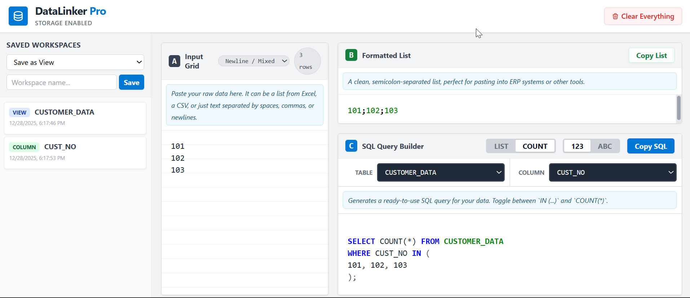

# DataLinker Pro v2

**The Persistent Bridge between Excel, ERPs, and SQL Databases**

DataLinker Pro is a lightweight, client-side productivity tool designed for developers, data analysts, and ERP power users. It eliminates the manual, error-prone work of reformatting data lists for use in different systems. This version introduces persistent storage, allowing you to save and recall your workspaces instantly.

 


---

## The Challenge

In many data-driven roles, a common task involves taking a list of identifiers (like customer IDs, order numbers, or SKUs) from a spreadsheet and using it in another system. This often requires tedious reformatting:

-   **For ERP Systems**: Manually adding semicolons between each item to create a search string (e.g., `101;102;103`).
-   **For SQL Databases**: Manually wrapping each item in quotes and separating them with commas to build an `IN` clause (e.g., `WHERE ID IN ('101', '102', '103')`).
-   **Handling Data Types**: Remembering to remove quotes for numeric columns.
-   **Repetitive Work**: Constantly rebuilding the same queries for different sets of data.
-   **Losing Work**: Closing the browser tab means starting all over again.

This process is not only time-consuming but also highly susceptible to syntax errors that can lead to failed searches or queries.

## The Solution: DataLinker Pro

DataLinker Pro is a "what you see is what you need" tool that automates this entire process in real-time. It provides a simple, three-panel interface that takes your raw input and instantly generates the exact formats you need.

With the introduction of **persistent workspaces**, you can now save your entire setup—input data, table names, column names, and query settings—directly in your browser. This transforms the tool from a simple converter into a powerful, reusable workbench for your common data tasks.

## Key Features

-   **Multi-Format Output**: Instantly generates both a semicolon-separated list (for ERPs) and a ready-to-run SQL query.
-   **Intelligent SQL Builder**:
    -   **Query Type Toggle**: Instantly switch between a `SELECT * ... IN (...)` query to fetch records and a `SELECT COUNT(*) ...` query to get a count.
    -   **Data Type Toggle**: Easily switch between `string` ('value') and `numeric` (value) formats for the `IN` clause.
-   **Smart Input Parsing**: Automatically cleans and parses data pasted from various sources (Excel, CSVs, plain text) with different delimiters like newlines, tabs, commas, or spaces.
-   **Persistent Workspaces**:
    -   Save your entire session (input data, table/column names, and settings) to your browser's local storage.
    -   Load any saved workspace with a single click.
    -   Organize saved workspaces as "Views" or "Columns" for intuitive retrieval.
-   **Zero-Backend & Secure**: A 100% client-side application built with vanilla JavaScript. Your data never leaves your browser, ensuring complete privacy and security.
-   **Real-time & Responsive**: All transformations happen instantly as you type. The UI is clean, modern, and built with Tailwind CSS.
-   **Single-File Deployment**: The entire application is a single `index.html` file, making it incredibly easy to host on services like GitHub Pages, share with colleagues, or run locally.

## How to Use

The workflow is designed to be as fast and intuitive as possible.

#### Step 1: Paste Your Data
Copy a column of data from Excel, a CSV, or any text source and paste it into the **Input Grid** (Panel A). The tool will automatically parse the values and show a row count.


#### Step 2: Get Your Formatted List
The **Formatted List** (Panel B) will instantly display your data as a clean, semicolon-separated list. Click the `Copy List` button to paste it directly into your ERP system or other tools.

```
101;102;103;104
```

#### Step 3: Build and Copy Your SQL Query
1.  **Configure**: In the **SQL Query Builder** (Panel C), select a saved Table and Column from the dropdowns, or type new ones in.
2.  **Choose Query Type**: Use the `LIST` / `COUNT` toggle to choose between fetching all data or just getting a count.
3.  **Set Data Type**: Use the `123` / `ABC` toggle to format the values for numeric or string-based SQL columns.
4.  **Copy**: The SQL query is generated in real-time. Click the `Copy SQL` button.

**String (ABC) Mode Example:**
```sql
SELECT * FROM customer_information
WHERE customer_id IN (
'101', '102', '103'
);
```

**Count (COUNT) Mode Example:**
```sql
SELECT COUNT(*) FROM customer_information
WHERE customer_id IN (
'101', '102', '103'
);
```

#### Step 4: Save and Load Your Workspace
1.  **Save**: To save your current setup, choose "Save as View" or "Save as Column" in the sidebar. Give it a descriptive name (e.g., `customer_info` or `customer_id`) and click `Save`.
2.  **Load**: Your saved workspace will appear in the sidebar. Click it anytime to instantly restore your input data and all associated settings.

## Technology Stack

-   **HTML5**: For the core structure and content.
-   **Tailwind CSS**: For a modern, responsive, and utility-first UI design.
-   **Vanilla JavaScript (ES6+)**: For all client-side logic, ensuring the app is fast, lightweight, and has no dependencies.

## Deployment

This application is a self-contained `index.html` file. It can be run by simply opening the file in a web browser.

For web deployment, it can be hosted on any static site hosting service. It is perfectly suited for **GitHub Pages**.

1.  Push the `index.html` file to a GitHub repository.
2.  In the repository settings, go to the "Pages" section.
3.  Select the branch to deploy from (e.g., `main`) and click `Save`.
4.  Your DataLinker Pro tool will be live and accessible to anyone you share the link with.

---

*Built to solve a real-world problem with simplicity and efficiency.*
